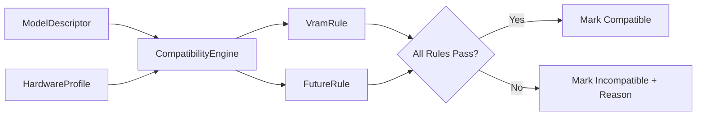

# Technical Documentation: Compatibility Module

## Design Overview
The Compatibility Engine evaluates whether a model specification can run on the target hardware. Rather than hardcoding memory checks, it runs models against a list of injected `CompatibilityRule` implementations.

This makes it easy to introduce new rules (e.g. quantization levels, thermal ceilings, token-per-second thresholds) without modifying existing logic (complying with Open-Closed Principle).

---

## Evaluation Flow

---

## Standard Rules

- **VramRule**:
  - In GPU mode (CUDA, ROCm, Metal), ensures model file size fits within physical VRAM.
  - In CPU mode, reads total system memory, deducts a **4 GB safety margin** to prevent OS freeze, and evaluates compatibility against the remainder.
