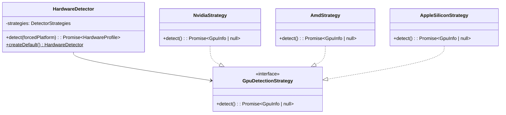

# Technical Documentation: Hardware Module

## Design Overview
The Hardware module is responsible for discovering raw hardware resource limits and compiling them into a unified `HardwareProfile` domain entity.

It uses a strategy-based detection approach to dynamically fetch platform metrics depending on whether the system is Linux, macOS, or Windows.

---

## Class Architecture

---

## Strategy Responsibilities

- **NvidiaStrategy**: Queries Nvidia CUDA memory using the native `nvidia-smi` CLI tool.
- **AmdStrategy**: Runs a generic CIM/WMI AdapterRAM check via Windows PowerShell to obtain GPU VRAM on Windows systems.
- **AppleSiliconStrategy**: Reads SPHardwareDataType from `system_profiler` to identify Unified Memory allocation.
- **CpuStrategy**: Interrogates Node.js `os` specifications (`cpus()`, `arch()`, `totalmem()`) to provide fallback constraints.
