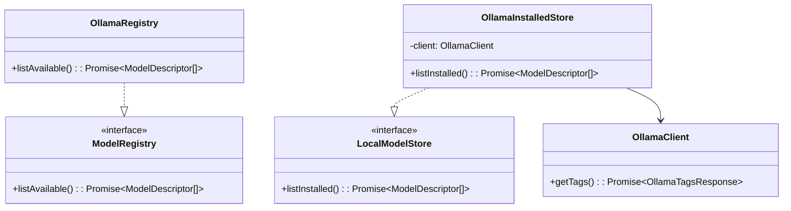

# Technical Documentation: Model Registry & Ollama Services

## Design Overview
The system is fully decoupled from the underlying inference engine. Instead of calling Ollama endpoints directly, application services interact with `ModelRegistry` (remote) and `LocalModelStore` (local) interfaces.

Ollama is treated as one implementation option of these interfaces.

---

## Service Architecture

---

## Core Components

- **OllamaClient**: Low-level HTTP helper that handles `fetch` and serializes DTO tags directly from the daemon endpoint (default `http://localhost:11434`).
- **OllamaInstalledStore**: Implements `LocalModelStore`. Queries the local client tags, parses file sizes into decimal Gigabytes, and handles exceptions gracefully (returning empty arrays if the daemon is down).
- **OllamaRegistry**: Implements `ModelRegistry`. Exposes the static hub metadata registry.
